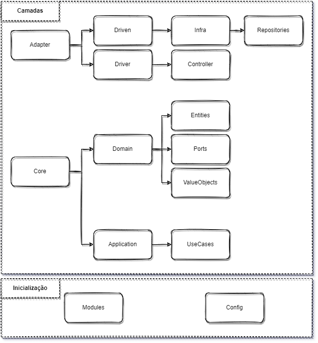
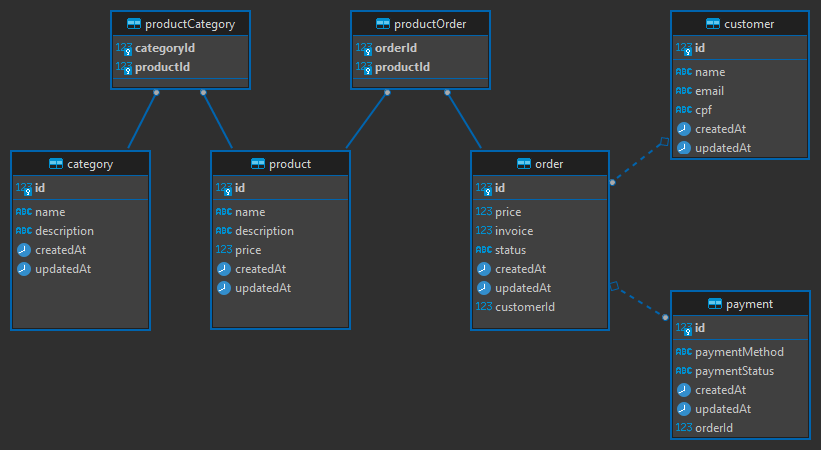
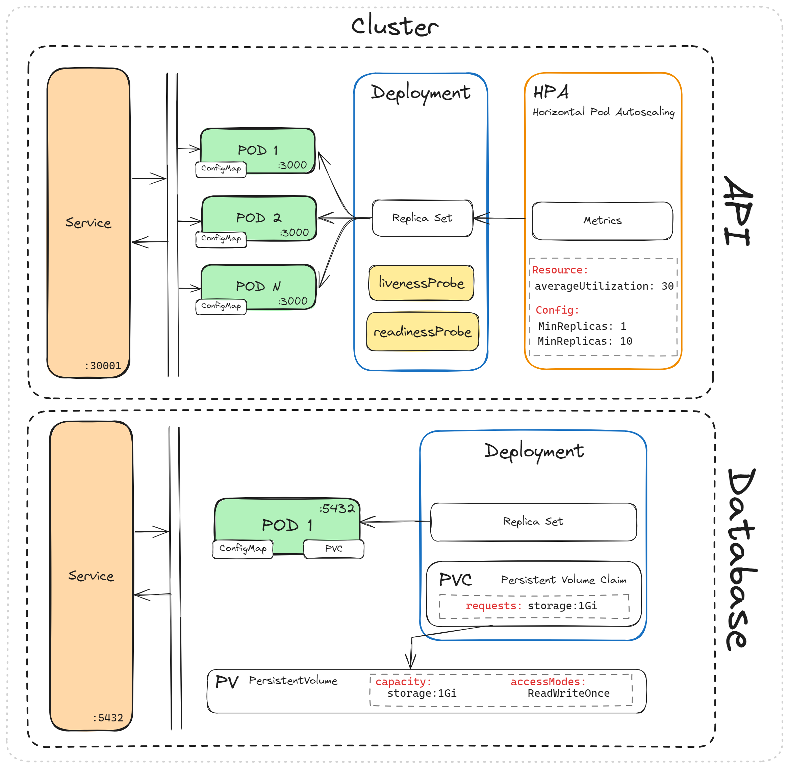

# Tech Challenge - FIAP - Arquitetura de Software

Este projeto foi implementado para o Tech Challenge da primeira fase da Pós Graduação de Arquetitura de Software pela FIAP. O projeto tem o objetivo de fazer o controle de uma lanchonete, onde é possivel gerenciar os produtos, categorias, pedidos e pagamentos.

### Estrutura do Projeto

- `src`

  - `modules`: Os módulos da aplicação, cada um responsável por uma parte específica do sistema, como categorias, clientes, pedidos e produtos. Cada módulo configura suas próprias entidades, repositórios e controladores.

  - `core`

    - `domain`: Contém as entidades, portas (ports), e interfaces que representam a lógica de domínio do sistema. Também inclui objetos de valor, DTOs entre outros recursos.
    - `application`: Aqui estão os casos de uso (use-cases) que implementam a lógica de negócios. Eles interagem com os repositórios por meio de ports para fazer a persistencia dos dados.

  - `adapter`

    - `driven`: Contém os repositórios responsáveis pela persistência de dados.
    - `driver`: Aqui estão os controladores que recebem as requisições HTTP e chamam os casos de uso apropriados.

  - `config`: Armazena arquivos de configuração, como variáveis de ambiente e os 'symbol' usados para injeção de dependência do NestJS.
  - 


## Arquitetura Hexagonal/Limpa

A arquitetura hexagonal é uma abordagem que enfatiza a separação das preocupações em camadas distintas e prove uma estrutura organizada e testável para sua aplicação. As camadas bem definidas facilitam a manutenção, testes e evolução do sistema.

1. Camada de Domínio (Core - Domain):

   - Contém as entidades de domínio que representam os objetos principais do sistema.
   - Define portas (ports) e interfaces que descrevem a interação com componentes externos, como repositórios.
   - Contém objetos de valor (value objects) que representam conceitos imutáveis do domínio.
   - Define DTOs (Data Transfer Objects) para transferir dados entre as camadas.

2. Camada de Aplicação (Core - Application):

   - Implementa os casos de uso (use-cases) que representam a lógica de negócios da aplicação.
   - Os casos de uso interagem com as portas definidas na camada de domínio para acessar os dados.

3. Camada de Adaptadores (Adapter):

   - A camada de repositórios (driven) é responsável por persistir os dados no banco de dados. Ela implementa as portas definidas no domínio.
   - A camada de controladores (driver) trata as requisições HTTP, chama os casos de uso apropriados e retorna respostas HTTP.

## Setup do ambiente de desenvolvimento

### Pré-requisitos

- [NodeJS](https://nodejs.org/)
- [Yarn](https://yarnpkg.com/)
- [Docker](https://www.docker.com/)
  - Instale também o [Docker Compose](https://docs.docker.com/compose/)
- [Visual Studio Code](https://code.visualstudio.com/) ou [WebStorm](https://www.jetbrains.com/webstorm/)


## Banco de Dados

A imagem abaixo mostra um diagrama ER (Entidade e Relacionamento) do banco de dados utilizado no projeto `docs/portal.drawio`:



## Configuração do Projeto

Antes de iniciar o projeto, siga as etapas abaixo para configurá-lo corretamente:

1. Copie o arquivo `settings.template` e renomeie-o para `settings.json`. O arquivo `settings.json` está localizado na pasta `src/config/`. Este arquivo contém as configurações essenciais do projeto, como variáveis de ambiente e configurações específicas. Certifique-se de definir as configurações apropriadas, como credenciais de banco de dados, portas e outras variáveis necessárias.

## Docker e Docker Compose

O projeto utiliza Docker e Docker Compose para facilitar a criação e execução do ambiente de desenvolvimento. Aqui estão os arquivos relevantes:

### Dockerfile

O arquivo Dockerfile define a imagem do contêiner do Node.js a ser usada para executar o projeto. Ele inclui a instalação do NestJS CLI para gerenciar o projeto. Certifique-se de que a versão do Node.js e do NestJS CLI seja apropriada para o seu projeto.

```dockerfile
FROM node:20

RUN apt update -y  && \
    apt install iputils-ping -y && \
    apt install procps -y && \
    yarn global add @nestjs/cli@9.0.0 -y

WORKDIR /home/node/app

COPY package*.json ./

RUN yarn install 

COPY . .

RUN yarn build

EXPOSE 3000

CMD [ "node", "dist/main.js" ]

```

### Docker Compose

O arquivo docker-compose.yml define os serviços a serem executados usando o Docker Compose. Ele inclui os serviços do aplicativo (Node.js) e do banco de dados (PostgreSQL).

```yaml
services:
  app:
    build: .
    ports:
      - 3000:3000
    mem_limit: 2g
    networks:
      - tech-challenge

  db:
    image: postgres:latest
    ports:
      - 5432:5432
    volumes:
      - ./.docker/dbdata:/opt/postgres/dbdata
    environment:
      POSTGRES_DB: postgres
      POSTGRES_USER: postgres
      POSTGRES_PASSWORD: root
    networks:
      - tech-challenge

networks:
  tech-challenge:
```

Para iniciar o projeto, siga estas etapas:

1. Certifique-se de ter o Docker e o Docker Compose instalados no seu sistema.

2. No diretório raiz do seu projeto, onde o arquivo docker-compose.yml está localizado, execute o seguinte comando para iniciar os serviços:

```bash
docker-compose up -d
```

Isso criará os contêineres para o aplicativo e o banco de dados.

3. Após a inicialização bem-sucedida, a aplicação estará disponível em `http://localhost:3000`. Certifique-se de que a porta 3000 esteja mapeada corretamente no arquivo `docker-compose.yml`.


### Infraestrutura com Kubernetes

Na pasta `kubernetes` é onde se encontra todos os arquivos de configuração de um cluster inteiro para nossa aplicação, utilizando configMap, HPA, PV, PVC, entre outras ferramentas disponíveis pela API do kubernetes.

Segue um diagrama de como foi estruturada a infraestrutura desse projeto:



Para subir todo nosso cluster, certifique-se de ter o kubernetes ativado em seu ambiente, e se estiver tudo certo, só seguir os seguintes passos:

Dentro da pasta `kubernetes` existem 2 subpastas, uma para API e outra para o Banco de Dados.


#### Banco de Dados
Vamos começar pelo Banco de Dados, porque nossa API depende dele para funcionar, então dentro da pasta `db` existe os seguintes arquivos:


1. `db-configmap.yaml`: Este arquivo é responsável por fornecer algumas variáveis uteis para nossa infra;
2. `db-pv-pvc.yaml`: Este arquivo é responsável por criar nossa unidade de armazenamento (`PV`) e uma solicitação de armazenamento (`PVC`) para nosso POD;
3. `db-deployment.yaml`: Este é o arquivo que irá criar nosso `Deployment` que fará todo o gerenciamento de nossos POD's utilizando a última versão do Postgres, fazendo o mapeamento dos volumes e do configMap;
4. `db-service.yaml`: Este é o arquivo que expõe nosso banco de dados para nosso cluster;

Para subir essa infraestrutura basta rodar o seguinte comando:
```bash
kubectl apply -f ./kubernetes/db
```

Estes comandos ira rodar todos os yaml encontrados dentro da pasta.


#### Aplicação
Agora que temos nosso banco de dados de pé, vamos para a API.

Dentro da pasta `kubernetes` é possivel encontrar a subpasta `api`, que é onde se encontra os arquivos de configuração do kubernetes para nossa API.

1. `api-configmap.yaml`: Este arquivo é responsável por fornecer as variaveis de configuração da nossa API;
2. `api-deployment.yaml`: Este é o arquivo que irá criar nosso `Deployment` que fará todo o gerenciamento de nossos POD's utilizando a última versão da aplicação disponibilizada no Docker Hub, fazendo o mapeamento do `configMap` e também configurando nossos testes com `livenessProbe` e `readinessProbe`;
3. `api-hpa.yaml`: Este é o arquivo responsável pelo escalonamento de nossa aplicação, o `HPA` será responsavel por gerenciar nosso `Deployment` criando novas réplicas dos PODs da nossa aplicação com base na carga de trabalho atual;
4. `api-service.yaml`: Este é o arquivo que expõe nossa API na porta `30001` para que possamos usar;

Para subir nossa aplicação basta rodar o seguinte comando:
```bash
kubectl apply -f ./kubernetes/api
```


Para verificar se todo o ambiente esta de pé, é possivel verificar pelo seguinte comando:
```bash
kubectl get cm,pv,pvc,pods,svc,deployment,hpa
```
Este comando irá te mostrar o status de todos os serviços que subimos com kubernetes.

---

Com isso, seu projeto estará configurado e em execução dentro de um ambiente Dockerizado, e disponibilizando uma infraestrutura completa em kubernetes para melhor disponibilidade da aplicação e facilitando o desenvolvimento.
